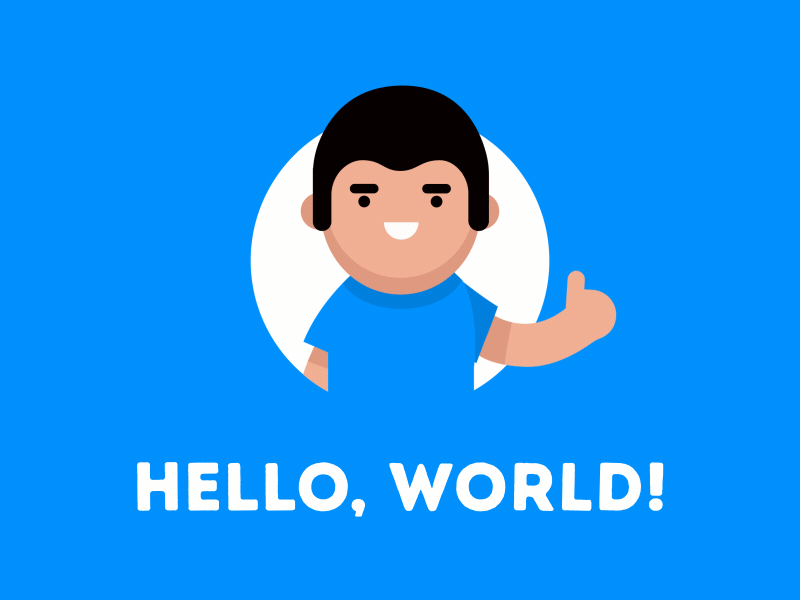

  
 

 ### Hi there, I'm Emiliano Barberis 👋

Actualmente estoy formándome como FullStack web developer en Henry 💻🤓.

Disfruto aprendiendo y ampliando mis conocimientos de forma autodidacta 💻🤓,mi objetivo es formar parte de una empresa aportando mis conocimientos ,experiencia y valores para que la empresa siga creciendo y asi poder lograr un crecimiento personal y profesional. 
La comunicación y el trabajo en equipo es para mí esencial para poder crecer como desarrollador. Soy proactivo y metódico, siempre busco nuevos retos y me adapto fácilmente a nuevos desafíos, estoy abierto a aprender nuevas tecnologías y lenguajes.

## Full stack web developer 🖥️

 

## 📍 Languages and Tools:

  Visual Studio Code
 

 

 HTML5
 

 

 CSS3
 

 

 JavaScript
 

 

 React
 

 

 SQL
 

 

 PostgreSql
 

 

 Git
 

 

 GitHub
 

 

 
  Nodejs</apan>
 

 
 

## 📍check my work:
## [Videogames-App] 
### 🚀 Technologies: React - Redux - NodeJS- Express - PostgreSQL - Sequelize - Css - Javascript
## [Mobi-App]
### 🚀 Technologies: React - Redux - NodeJS- Express - PostgreSQL - Sequelize - Firebase - Bootstrap - emailJs - Css - Javascript - Jwt - Socket.io - Styled Components
 

## 📍 Connect with me:

[][linkedin]
[][email]

[linkedin]: https://www.linkedin.com/in/emiliano-barberis-developer/
[email]: mailto:emibarberis26@gmail.com
[Videogames-App]:https://videogames-app-orpin.vercel.app/
[Mobi-App]:https://mobi-app.netlify.app/

<!--
**EmiB11/EmiB11** is a ✨ _special_ ✨ repository because its `README.md` (this file) appears on your GitHub profile.

Here are some ideas to get you started:

- 🔭 I’m currently working on ...
- 🌱 I’m currently learning ...
- 👯 I’m looking to collaborate on ...
- 🤔 I’m looking for help with ...
- 💬 Ask me about ...
- 📫 How to reach me: ...
- 😄 Pronouns: ...
- ⚡ Fun fact: ...
-->
